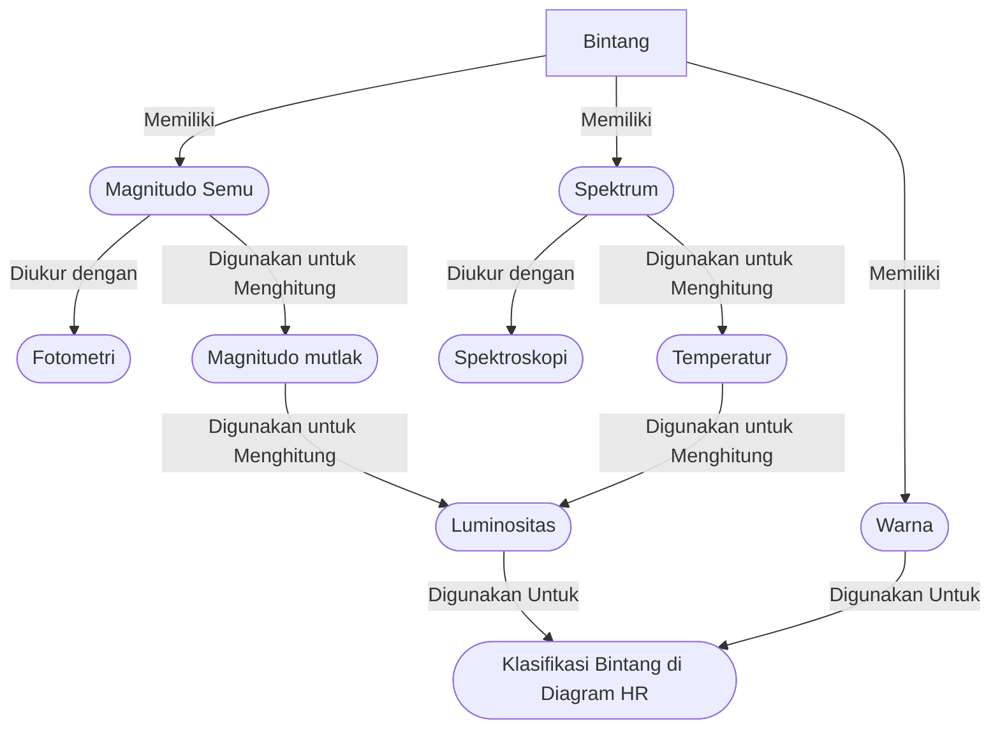

```mermaid
graph
%% nodes connection
B --"Memiliki"--> RB & RB2 & RB31
RB --"Diukur dengan"--> RB1
RB --"Digunakan untuk Menghitung"--> RB12
RB2 --"Diukur dengan"--> RB21
RB2 --"Digunakan untuk Menghitung"--> RB22
RB22 & RB12 --"Digunakan untuk Menghitung"--> RB3
RB31 & RB3 --"Digunakan Untuk"--> RB4

%% nodes definition
B[Bintang]
RB([Magnitudo Semu])
RB1([Fotometri])
RB12([Magnitudo mutlak])
RB2([Spektrum])
RB31([Warna])
RB21([Spektroskopi])
RB22([Temperatur])
RB3([Luminositas])
RB4([Klasifikasi Bintang di Diagram HR])
```
